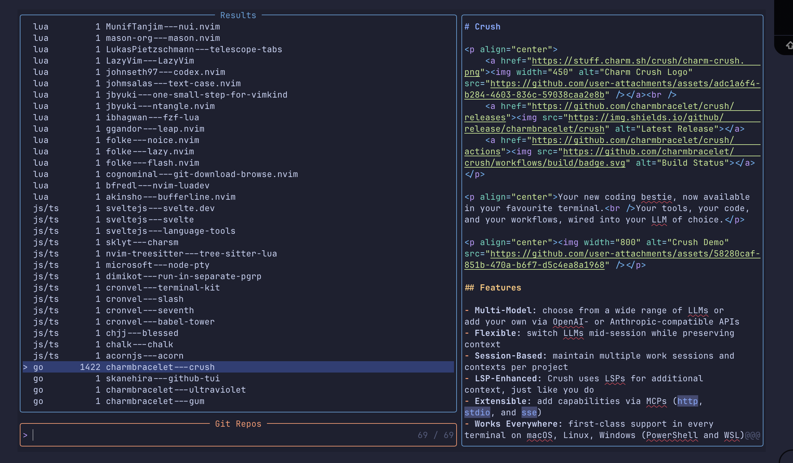

# git-download-browse.nvim

Dealing with gitHub repositories from Neovim.

Clone; browse; fork in a [worktree]

- `<leader>gc`  clone a repo
- `<leader>gv`  view the repos in telescope
- `<leader>gk` fork, branch and create a work tree 

The **clone dir** is a folder of your choice, (default: `~/git` )
Same for **fork** dir, (default `~/fork`)
Browsing  the clone dir  is done with Telescope
The previewer shows the  README.md of the current repo (in telescope).
The picker opens it.

## clone

The fork commands will add the fork to the clone dir, but also create
a branch named "forked" and a worktree folder in the worktree folder
(default: `~/forked`). Depends on the `gh` command.

Work in progress. Browsing works but you should have already cloned repos.
I did it with this [script](https://gist.github.com/cognominal/e81918a1444f1130f4256a7e578f7550)

Browse, clone, fork GitHub repositories from Neovim. The plugin stores clones
in a configurable directory, (default: `~/git` )
offers a shallow clone command, and ships a Telescope
picker with README previews.

The fork commands will add the fork to the clone folder, but also create
a branch named "forked" and a worktree folder in the worktree folder
(default: `~/forked`). Depends on the `gh` command.

TBD support other git hubs than github



## Requirements

- [nvim-lua/plenary.nvim](https://github.com/nvim-lua/plenary.nvim)
- [nvim-telescope/telescope.nvim](https://github.com/nvim-telescope/telescope.nvim)
- `git` available in your `$PATH`

## Installation (LazyVim / lazy.nvim)

Add the plugin to your LazyVim spec so dependencies load automatically.

```lua
return {
  {
    "cognominal/git-download-browse.nvim",
    dependencies = {
      "nvim-lua/plenary.nvim",
      "nvim-telescope/telescope.nvim",
    },
    config = function()
      require("git-download-browse").setup({
        reposDir = vim.fn.expand("~/git"),
        keymaps = {
          browse = "<leader>gv",
          clone = "<leader>gc",
          fork = "<leader>gk",
        },
      })
    end,
  },
}
```

For LazyVim, drop the spec into `lua/plugins/git-download-browse.lua`
(or any
plugin file under `lua/plugins`). LazyVim will pick it up automatically.

## Usage

- `:CloneGitRepo user/repo` or `:CloneGitRepo https://github.com/user/repo`
  clones the repository (shallow) into `<reposDir>/user---repo`.
  - If you omit the argument, the command falls back to the clipboard contents
    (`+` register first, then `*`). When the cursor is on such a string within
    double quotes.
   You can paste the string using `yi"`
- `:GitRepos` opens the Telescope picker listing downloaded repositories and
  switches Neovim's local directory (`:lcd`) to the selected entry when you
  confirm.
- `:GitFork [path|user/repo]` (or the default `<leader>gk`) forks the current
  repository using GitHub CLI, adds a `fork` remote, and creates a new worktree
  under `forked_dir`. Branch names start at `forked` and gain numeric suffixes
  if needed.
- The default `keymaps.browse` opens the picker (`<leader>gv`),
  `keymaps.clone` clones a repo (`<leader>gc`), and
  `keymaps.fork` forks the current repo (`<leader>gk`). Set any mapping to
  `false`/`nil` or override them inside `setup()` to rebind.
- Change `reposDir` in `setup()` to control where repositories are stored. The
  folder (and missing parents) is created automatically during `setup()`.

The picker previews project READMEs when available; otherwise it shows a
directory listing. Entries display an initial `F` when a fork remote is
configured for that repository.

## Tests

Run the Plenary test suite headlessly:

```sh
nvim --headless -u tests/minimal_init.lua -c "lua require('tests.run').run()"
```
